# Mozkit V.1.0-तुर (Tura) — Roadmap & Issues

> **Project**: Mozkit (Mozilla Campus Club of SLIIT)  
> **Timeline**: Mid-September 2026 (`V.0.0-वेग / Vega`) to Late December 2026 (`V.1.0-तुर / Tura`)  
> **Target Platform**: Linux (`pacman`, `yay`, `paru`, `apt`, `dnf`, `zypper`)  
> **Execution Model**: 2 Parallel Tracks (Track A: Engine & Tools, Track B: UI & UX), supporting 2–3 developers working concurrently (~2–3 tasks per week).

---

## Architecture & Vision Summary

1. **Terminal-Native Theming**: Seamlessly inherits terminal-defined ANSI colors for text and background (respects Gruvbox light/dark, Solarized, Catppuccin, etc.), preserving signature Mozkit Orange (`#ff4b0c`) as an accent.
2. **Flat Script Catalog ("Just show all scripts")**: No confusing Presets, Configs, or Packs hierarchies. A single searchable, filterable catalog.
3. **Dynamic 3-State Footer**: Unified footer component adjusting keybindings across Catalog, Preview, and Execution states without geometry shifts.
4. **fzf-Style Fuzzy Modal (`+`)**: Search and run external custom `.toml` scripts from the local filesystem with real-time fuzzy completion.
5. **Standard Toolset Engine**: Declarative tools: `install`, `write`, `delete`, `download`, `appendToFile`, `preappendToFile`, `addToPath`, and interactive `form` inputs.
6. **Strict Transactional Rollback ("Fucked Up? / Uno Reverse")**: Snapshots all files and records installed packages; on `esc` / `ctrl+c` or failure, cleanly restores files and uninstalls packages.
7. **Preview & Safety Confirmation**: Full preview of all actions and parameters, guarded by a 3-step confirmation flow to prevent accidental execution.

---

## Visual Roadmap

```mermaid
flowchart TD
    subgraph Sprint1["Sprint 1: Foundations (Sep W4)"]
        A1["A1: Action Dispatcher & Schema"]
        A2["A2: Flat Script Loader Engine"]
        B1["B1: Terminal ANSI Theming"]
        B2["B2: Version Breadcrumbs"]
    end

    subgraph Sprint2["Sprint 2: File Tools & Catalog UI (Oct W1)"]
        A3["A3: File Tools I (write, delete)"]
        A4["A4: File Tools II (append, prepend, download)"]
        B3["B3: Dynamic 3-State Footer"]
        B4["B4: Flat Catalog List View"]
    end

    subgraph Sprint3["Sprint 3: Shell Tools & Custom Script Modal (Oct W2)"]
        A5["A5: Shell Tool (addToPath)"]
        A6["A6: Form Engine & Variable Templating"]
        B5["B5: fzf-Style Fuzzy Modal (+)"]
        B6["B6: Custom Script TOML Validator UI"]
    end

    subgraph Sprint4["Sprint 4: Package Manager & Preview (Oct W3)"]
        A7["A7: Linux Package Manager Dispatcher"]
        A8["A8: Command Output Streamer"]
        B7["B7: Dedicated Action Preview Screen"]
        B8["B8: 3-Step Safety Confirmation Guard"]
    end

    subgraph Sprint5["Sprint 5: Transaction Journal & Interactive UI (Oct W4 - Nov W1)"]
        A9["A9: Transaction Journal Architecture"]
        A10["A10: File Snapshot Stash"]
        B9["B9: Interactive Form Modal Component"]
        B10["B10: Live Execution Viewport & Progress"]
    end

    subgraph Sprint6["Sprint 6: Rollback Handlers & UI (Nov W2)"]
        A11["A11: File & Path Rollback Handlers"]
        A12["A12: Package Uninstall Rollback Handler"]
        B11["B11: Live Rollback TUI Overlay"]
        B12["B12: Layout & Geometry Refinement"]
    end

    subgraph Sprint7["Sprint 7: Supervisor & Catalog Audit (Nov W3 - Nov W4)"]
        A13["A13: Abort Supervisor (esc/ctrl+c)"]
        A14["A14: Script Migration to Linux Tools"]
        B13["B13: Execution Summary & Stats Screen"]
        B14["B14: Keyboard Navigation Polish"]
    end

    subgraph MilestoneRelease["Release Milestone: Polish & Launch (Dec W1 - Dec W4)"]
        I1["I1: Multi-Distro End-to-End Testing (Arch, Ubuntu, Fedora)"]
        I2["I2: Documentation & Contributing Guides"]
        I3["I3: V.1.0-तुर (Tura) Packaging & Release CI"]
    end

    Sprint1 --> Sprint2 --> Sprint3 --> Sprint4 --> Sprint5 --> Sprint6 --> Sprint7 --> MilestoneRelease
```



---

## Detailed Sprint & Task Breakdown

### Sprint 1: Foundations (Sep 22 – Sep 28)

#### Issue A1: Action Dispatcher & Schema Definition
- **Track**: Track A (Engine)
- **Estimated Duration**: 3–4 days
- **Scope**:
  - Define `Action` interface with `Execute(ctx) error` and `Rollback(ctx) error` signatures.
  - Implement tool registry in `internal/engine/dispatcher.go`.
  - Validate that every action contains a known tool type and valid parameters.
- **Acceptance Criteria**: Unit tests verifying tool registration, valid dispatch, and rejection of unknown tools.

#### Issue A2: Flat Script Loader Engine
- **Track**: Track A (Engine)
- **Estimated Duration**: 2–3 days
- **Scope**:
  - Refactor `internal/engine/load_scripts.go` to recursively scan embedded `scripts/` for `.toml` files.
  - Parse scripts into a flat list of `Script` structs with title, description, and actions count.
  - Deprecate dependency on multi-tier `collection.toml`.
- **Acceptance Criteria**: All embedded scripts are loaded directly into a flat array on startup.

#### Issue B1: Terminal-Native ANSI Theming
- **Track**: Track B (UI)
- **Estimated Duration**: 3 days
- **Scope**:
  - Refactor `internal/assets/theme.go` to use standard terminal ANSI colors (`lipgloss.Color("7")`, `lipgloss.Color("8")`, and default terminal background) instead of hardcoded hex values (`#FFFFFF`).
  - Preserve Mozkit Orange (`#ff4b0c` or ANSI 202/208) for accents, active borders, and focus markers.
  - Remove forced dark canvas backgrounds so Mozkit naturally respects the user's terminal theme (e.g. Gruvbox light/dark, Catppuccin).
- **Acceptance Criteria**: Text and layout are crisp and legible across both light-mode and dark-mode terminal emulators.

#### Issue B2: Version Breadcrumbs System
- **Track**: Track B (UI)
- **Estimated Duration**: 2 days
- **Scope**:
  - Create `internal/version.go` defining release version (`v.0.0-vega` -> `v.1.0.0`) and codename (`Vega` -> `Tura`).
  - Update `internal/components/header.go` to format breadcrumbs as:
    - Root: `mozkit://v.0.0-vega/:`
    - Preview: `mozkit://v.0.0-vega/{script-name}:`
    - Execution: `mozkit://v.0.0-vega/{script-name}/exec:`
- **Acceptance Criteria**: Header breadcrumb accurately mirrors current navigation state and matches design mockups.

---

### Sprint 2: File Tools & Catalog UI (Sep 29 – Oct 5)

#### Issue A3: File Tools I (`write`, `delete`)
- **Track**: Track A (Engine)
- **Estimated Duration**: 3 days
- **Scope**:
  - Create `internal/engine/tools/file.go`.
  - Implement `write`: writes content to path, automatically creates missing parent directories, supports file replacement.
  - Implement `delete`: safely removes specified file if it exists.
  - Unit tests using temporary directories verifying permissions, overwrite, and parent folder creation.
- **Acceptance Criteria**: Automated tests pass for writing new files, overwriting existing files, and safe deletion.

#### Issue A4: File Tools II (`appendToFile`, `preappendToFile`, `download`)
- **Track**: Track A (Engine)
- **Estimated Duration**: 3–4 days
- **Scope**:
  - Implement `appendToFile`: appends content to target file without corrupting existing data.
  - Implement `preappendToFile`: prepends content to beginning of file while preserving remainder.
  - Implement `download`: downloads file via HTTP/HTTPS with proper timeout, response code check, and streaming to disk.
- **Acceptance Criteria**: Unit tests verifying byte-level integrity after append, prepend, and simulated download.

#### Issue B3: Dynamic 3-State Footer
- **Track**: Track B (UI)
- **Estimated Duration**: 3 days
- **Scope**:
  - Refactor `internal/components/footer.go` to accept a state parameter:
    - `FooterList`: `↑/k: up   ↓/j: down   enter: preview   +: custom script   ctrl+c: exit`
    - `FooterPreview`: `↑/k: up   ↓/j: down   enter: execute   esc: back   ctrl+c: exit`
    - `FooterExec`: `↑/k: up   ↓/j: down   esc: undo & back   ctrl+c: undo & exit`
  - Maintain identical horizontal and vertical layout geometry across all state changes.
- **Acceptance Criteria**: Footer dynamically updates shortcut labels between screens without visual flicker or jumping.

#### Issue B4: Flat Catalog List View
- **Track**: Track B (UI)
- **Estimated Duration**: 3 days
- **Scope**:
  - Update `internal/ui.go` to display all scripts immediately upon launch using `bubbles/list`.
  - Retain `/` fuzzy search across script titles and descriptions.
  - Add metadata badges (e.g. number of actions) to list items.
- **Acceptance Criteria**: Launching Mozkit opens directly to the full, searchable script catalog.

---

### Sprint 3: Shell Tools & Custom Script Modal (Oct 6 – Oct 12)

#### Issue A5: Shell Environment Tool (`addToPath`)
- **Track**: Track A (Engine)
- **Estimated Duration**: 3 days
- **Scope**:
  - Create `internal/engine/tools/env.go`.
  - Detect user's active shell configuration file (`~/.bashrc`, `~/.zshrc`, `~/.profile`).
  - Idempotently add `export PATH="<path>:$PATH"` (checks if entry is already present to prevent duplicate lines).
- **Acceptance Criteria**: PATH export successfully injected once into active shell rc file without duplication.

#### Issue A6: Form Engine & Variable Templating
- **Track**: Track A (Engine)
- **Estimated Duration**: 4 days
- **Scope**:
  - Parse `form` actions containing input field definitions (key name, prompt, default).
  - Implement string interpolation replacing `{{ .key_name }}` across subsequent action parameters.
- **Acceptance Criteria**: Engine accepts key-value pairs from a completed form and substitutes values into downstream actions.

#### Issue B5: fzf-Style Fuzzy Finding Modal (`+`)
- **Track**: Track B (UI)
- **Estimated Duration**: 4 days
- **Scope**:
  - Create `internal/components/fuzzy_picker.go`.
  - Listen for `+` hotkey in list view to launch fuzzy modal overlay.
  - Scan local directory and `~/.config/mozkit/scripts` for `.toml` files.
  - Filter results in real-time as the user types using `github.com/sahilm/fuzzy`.
  - Support `↑/↓` navigation and `enter` to select.
- **Acceptance Criteria**: Pressing `+` opens an instant fuzzy finder allowing filename search and selection of local `.toml` scripts.

#### Issue B6: Custom Script TOML Validator UI
- **Track**: Track B (UI)
- **Estimated Duration**: 2 days
- **Scope**:
  - Validate selected custom script file against Mozkit Script schema.
  - Display non-blocking error dialog if the file contains TOML syntax errors or missing required fields.
  - On valid parse, transition directly to the preview screen.
- **Acceptance Criteria**: Clear error messaging on invalid TOML; valid scripts smoothly proceed to action preview.

---

### Sprint 4: Package Manager & Preview (Oct 13 – Oct 19)

#### Issue A7: Linux Package Manager Dispatcher (`install`)
- **Track**: Track A (Engine)
- **Estimated Duration**: 4 days
- **Scope**:
  - Create `internal/engine/tools/pkg.go`.
  - Probe system PATH for package managers: `pacman`, `yay`, `paru`, `apt-get`, `dnf`, `zypper`.
  - Dispatch non-interactive installation (`pacman -S --noconfirm`, `apt-get install -y`, etc.).
  - Support fallback package names in arguments (`["fd-find", "fd"]`).
- **Acceptance Criteria**: Package installer successfully identifies host manager and runs non-interactive installs.

#### Issue A8: Command Output Streamer
- **Track**: Track A (Engine)
- **Estimated Duration**: 3 days
- **Scope**:
  - Implement streaming stdout/stderr reader using `io.Pipe` and Bubbletea commands (`tea.Cmd`).
  - Forward live output line-by-line to the UI without blocking the Bubbletea event loop.
- **Acceptance Criteria**: Live terminal output streams in real time during command execution.

#### Issue B7: Dedicated Action Preview Screen
- **Track**: Track B (UI)
- **Estimated Duration**: 3 days
- **Scope**:
  - Create dedicated preview screen in `internal/components/preview.go`.
  - Display script title, description, and scrollable action list.
  - Show tool badges (`[install]`, `[write]`, `[delete]`, `[download]`, `[addToPath]`, `[form]`).
  - Display user responsibility notice ("*user is responsible for anything that happens to the system...").
- **Acceptance Criteria**: Full preview renders all actions, parameters, and notices before execution is allowed.

#### Issue B8: 3-Step Safety Confirmation Guard ("No Accidental Execute")
- **Track**: Track B (UI)
- **Estimated Duration**: 3 days
- **Scope**:
  - Implement visual confirmation step bar in the preview screen:
    - `Step 1: Press ENTER to confirm (1/3)`
    - `Step 2: Are you sure? Press ENTER (2/3)`
    - `Step 3: Press ENTER to execute (3/3)`
  - Pressing `esc` at any time cancels confirmation and returns to script list.
  - On 3rd confirmation, transition cleanly to execution state (`mozkit://{version}/{script}/exec:`).
- **Acceptance Criteria**: Strict 3-step confirmation prevents accidental execution; `esc` cleanly cancels.

---

### Sprint 5: Transaction Journal & Interactive UI (Oct 20 – Nov 2)

#### Issue A9: Transaction Journal Architecture
- **Track**: Track A (Engine)
- **Estimated Duration**: 4 days
- **Scope**:
  - Create `internal/engine/journal/journal.go`.
  - Define `Transaction` struct tracking executed steps, inverse actions, and status.
  - Provide an append-only in-memory journal of completed mutations.
- **Acceptance Criteria**: Every executed mutating action logs an inverse rollback action into the active journal.

#### Issue A10: File Snapshot Stash
- **Track**: Track A (Engine)
- **Estimated Duration**: 3 days
- **Scope**:
  - Implement on-disk file snapshot stashing in `~/.cache/mozkit/backups/{tx_id}/`.
  - Save exact byte copies of files prior to `write`, `appendToFile`, `preappendToFile`, or `delete`.
- **Acceptance Criteria**: Pre-mutation snapshots created reliably with proper error handling.

#### Issue B9: Interactive Form Modal Component
- **Track**: Track B (UI)
- **Estimated Duration**: 4 days
- **Scope**:
  - Create `internal/components/form.go` using `bubbles/textinput`.
  - Render form fields for scripts containing `form` actions.
  - Collect user inputs, validate entries, and return data to the execution loop.
- **Acceptance Criteria**: Interactive form modal pauses script execution to collect and validate user inputs.

#### Issue B10: Live Execution Viewport & Progress
- **Track**: Track B (UI)
- **Estimated Duration**: 4 days
- **Scope**:
  - Redesign execution screen to render step progress bar: `[3/7] Installing git...`.
  - Stream live stdout/stderr in a scrollable viewport with auto-scroll.
- **Acceptance Criteria**: Clean progress bar and live terminal log stream during active execution.

---

### Sprint 6: Rollback Handlers & UI (Nov 3 – Nov 16)

#### Issue A11: File & Path Rollback Handlers
- **Track**: Track A (Engine)
- **Estimated Duration**: 4 days
- **Scope**:
  - Implement reverse execution for file actions:
    - Newly created files -> removed.
    - Modified files -> restored from backup stash.
    - Deleted files -> restored from backup stash.
    - `addToPath` -> export line stripped from shell rc file.
  - Automated tests verifying byte-level parity after simulated rollback.
- **Acceptance Criteria**: File system restored to exact pre-execution state upon rollback.

#### Issue A12: Package Uninstall Rollback Handler
- **Track**: Track A (Engine)
- **Estimated Duration**: 4 days
- **Scope**:
  - Implement inverse action for `install`:
    - Track packages newly installed in the current transaction.
    - Dispatch package removal command (`pacman -R --noconfirm`, `apt-get purge -y`, etc.).
- **Acceptance Criteria**: Newly installed packages are cleanly uninstalled when rollback is invoked.

#### Issue B11: Live Rollback TUI Overlay ("Fucked Up?")
- **Track**: Track B (UI)
- **Estimated Duration**: 3 days
- **Scope**:
  - When rollback triggers, transition screen to an undo view:
    - Reverse progress indicator: `Undoing changes... [2/4] Restoring ~/.zshrc`.
    - Display completed undo steps and final status.
- **Acceptance Criteria**: Reassuring, clear visual feedback during rollback execution.

#### Issue B12: Layout & Geometry Refinement
- **Track**: Track B (UI)
- **Estimated Duration**: 2 days
- **Scope**:
  - Fine-tune responsive layout calculations in `sizeCheck`.
  - Ensure flawless rendering across standard 80x24 terminals and wide displays.
- **Acceptance Criteria**: No layout overflow or clipped borders across various terminal window sizes.

---

### Sprint 7: Supervisor & Catalog Audit (Nov 17 – Nov 30)

#### Issue A13: Abort & Interruption Supervisor
- **Track**: Track A (Engine)
- **Estimated Duration**: 3 days
- **Scope**:
  - Intercept `ctrl+c` and `esc` during script execution.
  - Halt active child processes immediately and trigger rollback pipeline.
  - Handle OS signals (`SIGINT`, `SIGTERM`) safely without corrupted state.
- **Acceptance Criteria**: Cancellation cleanly interrupts active execution and triggers full rollback.

#### Issue A14: Script Migration to Linux Tools Schema
- **Track**: Track A (Engine)
- **Estimated Duration**: 4 days
- **Scope**:
  - Remove deprecated Windows PowerShell scripts.
  - Rewrite all embedded scripts in `scripts/` using new tool schema:
    - Development Essentials (Git, Neovim, Docker, build tools).
    - Terminal & Shell Customization (Zsh, Starship prompt, nerd fonts).
    - Language Runtimes (Node.js/fnm, Python/Conda, Go, Rust).
- **Acceptance Criteria**: All embedded scripts validate against schema and run successfully.

#### Issue B13: Post-Execution Summary Screen
- **Track**: Track B (UI)
- **Estimated Duration**: 3 days
- **Scope**:
  - Summary card upon successful completion or rollback:
    - Number of actions completed, files modified, packages installed.
    - Suggested next steps (e.g. `source ~/.bashrc` or reboot).
- **Acceptance Criteria**: Polished summary card before final program exit.

#### Issue B14: Keyboard Navigation Polish & Accessibility
- **Track**: Track B (UI)
- **Estimated Duration**: 3 days
- **Scope**:
  - Complete keybinding audit (`j/k`, arrow keys, tab cycling, escape handling).
  - Ensure zero key collisions between modals, lists, and viewports.
- **Acceptance Criteria**: Seamless home-row keyboard navigation throughout the application.

---

### Release Milestone: Polish & Launch (Dec 1 – Dec 28)

#### Issue I1: Multi-Distro End-to-End Testing
- **Track**: Joint (Integration)
- **Estimated Duration**: 1 week (Dec 1 – Dec 7)
- **Scope**:
  - Test matrix across clean Docker containers / VMs: Arch Linux, Ubuntu 24.04, Fedora 40.
  - Verify script preview, execution, form prompt, and cancellation rollback on each distribution.
- **Acceptance Criteria**: Zero fatal errors or unhandled panics across all test distros.

#### Issue I2: Documentation & Contributing Guides
- **Track**: Joint (Documentation)
- **Estimated Duration**: 1 week (Dec 8 – Dec 15)
- **Scope**:
  - Update `README.md` with new screenshots, keybindings, and architecture overview.
  - Create `CONTRIBUTING.md` with TOML tool reference and custom script guide.
- **Acceptance Criteria**: Clear, friendly documentation for end users and community script contributors.

#### Issue I3: V.1.0-तुर (Tura) Packaging & Release CI
- **Track**: Joint (DevOps)
- **Estimated Duration**: 1 week (Dec 16 – Dec 24)
- **Scope**:
  - Setup GitHub Actions release workflow for Linux `amd64` and `arm64` binaries.
  - Tag and publish official `V.1.0-तुर` release on GitHub.
- **Acceptance Criteria**: Automated CI successfully builds and publishes release binaries.

---

## Verification & Quality Assurance

### Automated Testing Commands
```bash
# Run all unit tests for engine tools and dispatcher
go test -v ./internal/engine/tools/...

# Run transaction journal and rollback tests
go test -v ./internal/engine/journal/...

# Validate embedded TOML scripts against the tool schema
go test -v ./scripts/...

# Run UI model update unit tests
go test -v ./internal/components/...
```

### Manual Acceptance Checklist
1. **Theming**: Launch Mozkit in both dark and light terminal profiles; verify text uses terminal ANSI colors and Mozkit Orange accents pop cleanly.
2. **Catalog Navigation**: Launch Mozkit; verify immediate flat catalog. Press `/` and search; verify instantaneous fuzzy filtering.
3. **Fuzzy Custom Script Loader**: Press `+`, type partial name of a local `.toml` file; verify fuzzy matching, selection, and transition to preview.
4. **Safety Confirmation**: Press `Enter` to open preview. Press `Enter` once (1/3), press `esc` — verify cancel. Press `Enter` 3 times; verify execution begins.
5. **Strict Rollback ("UNO Reverse")**: Start an execution that writes a file and installs a package. Press `ctrl+c` mid-execution. Verify:
   - Rollback screen displays progress.
   - Written file is deleted or restored to original state.
   - Package is uninstalled via package manager.
   - Terminal exits cleanly.
